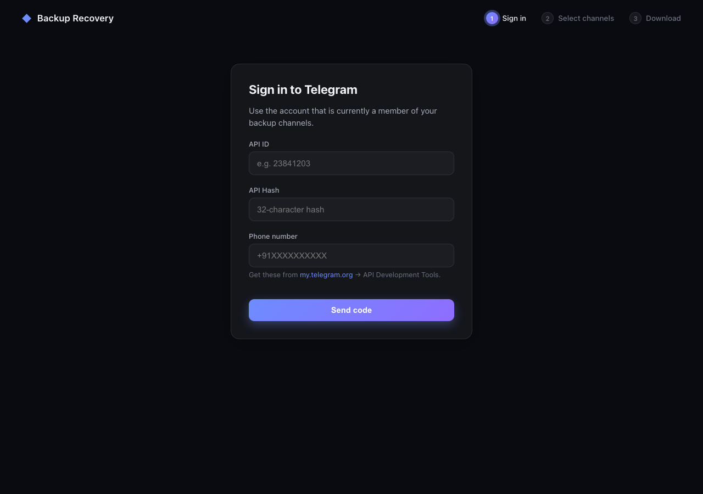
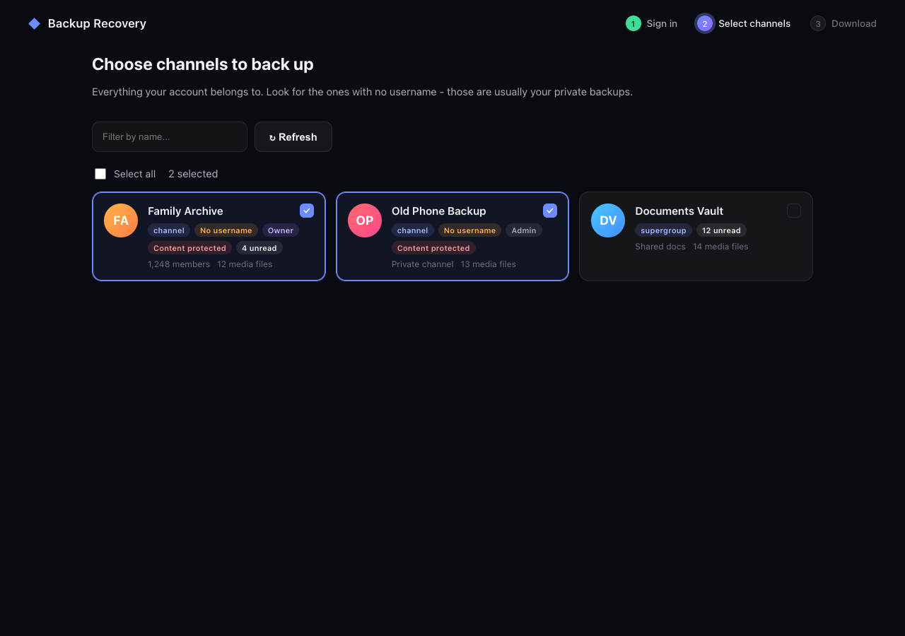
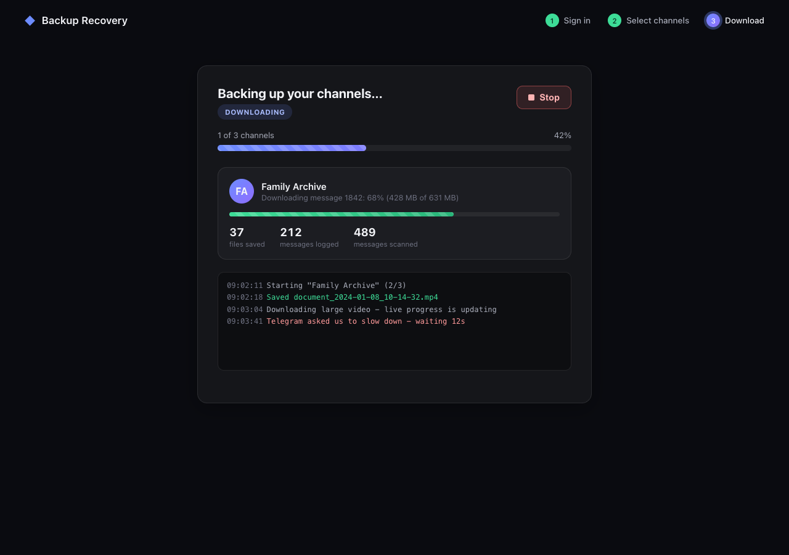

<div align="center">

# 📦 Telegram Backup Recovery

### Recover your own photos, videos, files & links from "content-protected" Telegram channels

A local Flask app for downloading media and message logs from Telegram
channels your account can already access, including channels where
"Restrict Saving Content" is enabled.

[](LICENSE)
[](https://www.python.org/downloads/)
[](https://flask.palletsprojects.com/)
[](https://docs.telethon.dev/)
[](CONTRIBUTING.md)

**Keywords:** Telegram backup tool - Telethon Python GUI - download Telegram channel media - bypass restrict saving content - self-hosted Telegram downloader - Telegram cloud storage export - Flask Telegram web app

</div>

---

## Why this exists

Telegram channels are handy for storing old photos, documents, links, and
other personal backups. If **"Restrict Saving Content"** was enabled on a
channel, the official apps can block saving even when your current account
is still a member.

This app uses [Telethon](https://docs.telethon.dev/) to talk to Telegram's
API directly. Your account still has to be a real member of the channel.
The app just saves the media and message text to disk.

> **This is for recovering your own data from channels you are a member
> of.** It is not a tool for scraping or archiving other people's private
> content without permission. See [Ethics & scope](#-ethics--scope) below.

---

## ✨ Features

- 🔐 Browser login with API ID/hash, phone number, OTP, and two-factor
  password handling.
- 🖼️ Channel picker for every channel/group your account belongs to, with:
  - profile picture (loads in progressively, no layout jank)
  - channel type (channel vs. supergroup vs. group)
  - a **"no username" badge** for spotting private backup channels
  - owner / admin / verified / scam-or-fake / content-protected / unread badges
  - member count and last-activity time
  - search-to-filter and select-all
- ⬇️ Download photos, videos, documents, and a timestamped
  `messages_and_links.txt` file for each selected channel.
- 📊 Live progress over Server-Sent Events, including current file progress,
  message counts, saved-file counts, and Telegram rate-limit messages.
- 🛑 Stop button that cancels the running backup and keeps files already
  saved on disk.
- 🎨 Responsive browser UI.
- 🧵 Telethon runs on a background asyncio loop, so Flask requests stay
  responsive while downloads are running.

---

## 📸 Screenshots

<div align="center">

| Sign in | Select channels | Live progress |
|---|---|---|
|  |  |  |

</div>

> Run the app and drop your own screenshots into `docs/screenshots/` to
> replace these placeholders. See [`docs/screenshots/README.md`](docs/screenshots/README.md).

---

## 📋 Table of contents

- [Why this exists](#why-this-exists)
- [Features](#-features)
- [Screenshots](#-screenshots)
- [How it works](#-how-it-works)
- [Quick start](#-quick-start)
- [Getting your API ID / API Hash](#-getting-your-api-id--api-hash)
- [Usage walkthrough](#-usage-walkthrough)
- [Project structure](#-project-structure)
- [Configuration & output layout](#-configuration--output-layout)
- [Ethics & scope](#-ethics--scope)
- [Security notes](#-security-notes)
- [Roadmap](#-roadmap)
- [Contributing](#-contributing)
- [FAQ](#-faq)
- [License](#-license)

---

## 🔧 How it works

```
 Browser (you)  <──HTTP + SSE──>  Flask app  <──MTProto API──>  Telegram
                                     │
                                     └── Telethon client on a background
                                         asyncio loop, so nothing blocks
```

Telegram's **"Restrict Saving Content"** toggle disables the forward/save
buttons *inside official Telegram apps only* - it's a client-side UI hint,
not a server-side access control. [Telethon](https://docs.telethon.dev/)
talks to the same MTProto API those apps use, just without that
restriction applied, so a genuine channel member can still fetch and save
the underlying media.

The Flask app runs **entirely on your own machine** and binds to
`127.0.0.1` only - nothing about your account, messages, or media passes
through any third-party server.

---

## 🚀 Quick start

```bash
git clone https://github.com/pgcodedev/telegram-backup-recovery.git
cd telegram-backup-recovery
python3 -m venv venv
source venv/bin/activate
pip install -r requirements.txt
python app.py
```

Then open **http://127.0.0.1:5000** in your browser.

Requires **Python 3.9+**. No database, no Docker, no build step - just
Flask, Telethon, and a browser.

---

## 🔑 Getting your API ID / API Hash

1. Go to **[my.telegram.org](https://my.telegram.org)** and log in with the
   phone number of the account that's currently a **member** of your backup
   channels (your main, accessible account).
2. Click **API Development Tools**.
3. Fill in any app name/platform (this doesn't need to match anything) and
   submit.
4. Copy the **`api_id`** and **`api_hash`** shown - you'll paste these into
   the app's login screen.

---

## 🧭 Usage walkthrough

1. **Sign in** - enter your API ID, API Hash, and phone number (with
   country code, e.g. `+91...`). You'll receive a login code via Telegram
   or SMS; enter it, and your two-step password too if you have one set.
2. **Select channels** - every channel/group your account belongs to
   appears as a card. Since your backup channels likely have no title
   you'd recognize by username, look for the **"No username"** badge, or
   type into the search box. Click cards (or "Select all") to multi-select.
3. **Choose a save folder** - type a path or click **Browse...** for a native
   folder picker. Defaults to `./telegram_backup`.
4. **Download selected** - watch the live progress screen. Use **Stop** at
   any time; anything already downloaded stays on disk.

---

## 📁 Project structure

```
telegram-backup-recovery/
├── app.py                     # Flask backend + Telethon integration
├── requirements.txt
├── templates/
│   └── index.html             # Single-page app shell
├── static/
│   ├── css/style.css          # Theming, layout, animations
│   └── js/app.js              # Auth flow, channel rendering, SSE progress
├── docs/
│   └── screenshots/           # README images
├── LICENSE
├── CONTRIBUTING.md
└── .gitignore
```

---

## 📂 Configuration & output layout

No config file needed - everything is entered in the browser at runtime.
A `backup_session.session` file is created next to `app.py` after your
first successful login so you won't need to re-enter the OTP on future
runs.

Downloaded data is organized per channel:

```
telegram_backup/
└── <Channel Name>/
    ├── media/                     # photos, videos, documents
    └── messages_and_links.txt     # every text message & link, timestamped
```

---

## ⚖️ Ethics & scope

This project is built for **one specific, legitimate use case**: recovering
your own content from your own Telegram channels using an account that is
already a genuine member of them. It intentionally:

- does **not** join channels on your behalf
- does **not** scrape channels you're not already a member of
- does **not** circumvent Telegram account authentication - you log in
  with your own credentials, the normal way

Please respect other users' privacy and Telegram's
[Terms of Service](https://telegram.org/tos) when using this tool.

---

## 🔒 Security notes

- Your `api_hash`, phone number, and `.session` file are equivalent to
  account credentials. **Never commit them** - the included `.gitignore`
  already excludes `*.session` files.
- The Flask app binds to `127.0.0.1` only and keeps your logged-in Telethon
  client in server memory (not per-browser-session), so this is designed
  for **single-user local use**. Don't expose port 5000 to your network or
  the internet without adding real authentication first.
- Downloaded media stays on your local disk; nothing is uploaded anywhere.

---

## 🗺️ Roadmap

- [ ] Resume support (skip already-downloaded messages on re-run)
- [ ] One-click `.zip` export when a backup finishes
- [ ] Docker image
- [ ] Light theme

See [CONTRIBUTING.md](CONTRIBUTING.md) if you'd like to help with any of these.

---

## 🤝 Contributing

Contributions are welcome! Please read [CONTRIBUTING.md](CONTRIBUTING.md)
for guidelines, then open a PR.

---

## ❓ FAQ

**Does this work if I don't remember the channel's invite link?**
Yes - the channel picker lists every channel/group your logged-in account
belongs to, with no need for a link or username.

**Will this get my account banned?**
Telethon is a widely used, actively maintained MTProto client library used
by many legitimate tools. This app only reads channels you're already a
member of using your own credentials - it doesn't automate spammy or
abusive behavior. That said, downloading very large channels quickly can
trigger Telegram's normal rate limits (`FloodWaitError`); the app handles
these automatically by waiting the required time.

**Can I run this on a server and access it remotely?**
Not out of the box - see [Security notes](#-security-notes). It's built as
a local, single-user tool.

**Why Flask instead of a desktop GUI (Tkinter/PyQt)?**
A browser UI is far more responsive (no beachballing on macOS), easier to
make look good, and works identically cross-platform without packaging a
native app.

---

## 📄 License

[MIT](LICENSE) - do what you want with it, just keep the license notice.

<div align="center">

If this saved your old memories, consider ⭐ starring the repo.

</div>
